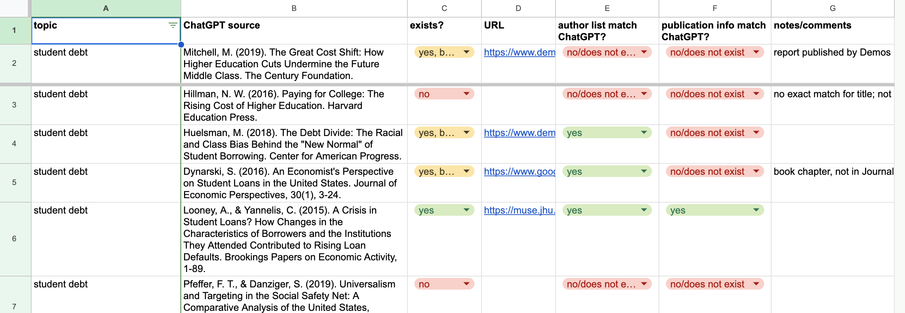

::: {.callout-note}
In Spring 2025 I ran this activity again, with some modifications. 

- I allowed the students to use any LLM they wanted, and had a column to track that. 
- I told them to prompt the LLM to include page references. The LLM didn't always include page refs, and I don't know to what extent this was because the LLM didn't follow instructions or the students didn't. 
- Following the initial check of whether the cited source exists, I had the students extract the sentence with the citing claim, and then check the page ref to see if the source actually made or supported that claim. If the source was too complex for the student to understand, they should put down "unable to tell" whether it supports the claim. 

The resulting spreadsheet is [here](https://docs.google.com/spreadsheets/d/1Fz-qF53LCvf2tUwOuayH7NT2GdimaUg6JFHIkrmkTes/edit?gid=0#gid=0). 

Compared to the previous time I ran this activity: 

- LLMs are much less likely to hallucinate citations than in Fall 2023: 80% of the sources actually exist
- But the page references are garbage: only 33% of the sources clearly supported the claims they were cited for, with another 8% giving "partial" support. And 21% of the existing sources did *not* support the claim. 
- In the following discussion, we figured out that, when the LLM gave accurate citations, it had "web search" mode enabled. 

This last point lead to an unplanned but very useful discussion of the difference between how students think LLMs work (basically like the way they would consult references in writing a paper), vs. how LLMs actually work, with and without RAG/web search mode. 
:::

This week I did a "fact checking ChatGPT" activity with my Critical Thinking class.  It has some distinct aims from other ChatGPT activities I've seen, and seemed to work well, so I thought I'd write it up real quick. 

I've seen lots of examples of classroom activities that explore the limitations (and strengths) of ChatGPT as a writer.  Some of my students mentioned they or their friends had done things like this.  For this activity, I decided to focus instead on ChatGPT as a source of information.  We've just spent three weeks learning how to evaluate other sources:  [a unit on appeals to authority](https://fairy-shrimp.netlify.app/09-expertise.html) based on [feminist work on epistemic trustworthiness](https://dhicks.github.io/posts/2023-09-25-teaching-expertise.html), and then [a unit on fact checking (social) media using the SIFT method](https://fairy-shrimp.netlify.app/11-SIFT-1.html).  

To prepare for the activity, I asked students to create an OpenAI account if they didn't already have one, and bring their laptops to class if they don't usually do so.  I also told them to read Ted Chiang's [essay](https://www.newyorker.com/tech/annals-of-technology/chatgpt-is-a-blurry-jpeg-of-the-web) "ChatGPT is a Blurry JPEG of the Web," and set up the Google Sheet that's linked below.  

Then, in class, I gave students these instructions for the activity: 

1. Prompt ChatGPT to write a short paper on a topic that includes citations and a bibliography: 
   > Hi ChatGPT.  Can you write a short paper on the rise of college debt, including a bibliography with five recent academic citations? 

2. For each bibliography entry, use search tools to try to determine whether the item actually exists. 
    - Does the author list match what ChatGPT said?
    - Was it published in the place ChatGPT said it was published?

3. Record your findings on this Google Sheet: [tinyurl.com/2xdcz7mo](https://tinyurl.com/2xdcz7mo)

The spreadsheet was set to "anyone can edit."  I filled in the first few rows myself as an example, using the citations from the essay ChatGPT generated in response to my college debt prompt.  Columns C, E, and F (does the item exist, does the author list match, does the publication info match) use data validation rules, restricting the possible values.  This makes it simple to set up the pivot table in the "exists?" sheet, which we use in the debrief/reflection phase. 

The prompt needs to request citations and a bibliography explicitly; otherwise ChatGPT doesn't include them.  This might be different if you're using something like Microsoft Bing Chat.  

After walking through the instructions abstractly, I gave a short demonstration by repeating the work I'd done with the first couple of rows.  This included a quick reminder of Google Scholar, which a student had mentioned a few weeks earlier when we were discussing expertise.  

Students spent about 40 minutes working on this activity, mostly in pairs or individually.  I said explicitly that I wanted to get as large a sample of bib items as possible, and so didn't want them to work in their table-groups (5-8 students).  It was a nice, chill, student-oriented class session:  I just wandered around, answering questions, helping with the rare tricky case, and chatting with students.  

To close out the activity, I spent 15 minutes on a whole-class discussion of three questions:  

1. How frequently did ChatGPT manufacture citations?

2. How does this relate to Chiang's essay, "ChatGPT Is a Blurry 
JPEG of the Web"?

3. What implications does this have for using LLMs like ChatGPT
    - To write papers? 
    - As information sources (Google Bard, Microsoft Bing Chat)? 
    
Question 1 was easy to answer with the pivot table.  In our case, ChatGPT manufactured 38% of citations (counting only the ones that do not exist at all) or 58% (including the ones that exist but have metadata errors).  A few students said this is what they expected to see — based on doing some similar experiments on their own — but I and other students expected the rate of manufactured citations to be somewhat higher.  

Not many of the students had really digested Chiang's essay, so this turned into an impromptu lecture.  We're covering argument by analogy next week, so I'll probably use Chiang's analogy as a recurrent example.  

Students were pretty thoughtful about the implications.  We talked about how faculty are experts, and can instantly recognize manufactured citations in our areas of expertise.  Students were a little uncertain about how to regard the citations that actually existed.  Some felt these were reliable, but others made the inference that you'd have to actually go and read the paper itself to figure out whether it made the claims ChatGPT was attributing to it.  In their one-minute papers, lots of students indicated that they no longer trust ChatGPT as a source of information.  

All together, this activity went really well:  students were very engaged, and came away with a healthy skepticism of LLMs.  Next time, I might make the spreadsheet-filling itself homework rather than an in-class activity.  Specifically, I might devote the last 15-20 minutes of the previous session to getting student started on filling in the spreadsheet, then have them complete it (for two different prompts) before the next session.  Then, in "the ChatGPT session proper," we'd start with 10 minutes or so on any tricky references, and have about an hour for the reflective discussion.  This would give us lots of time to unpack Chinag's essay and relate it to the results of the fact check.  

---

Coincidentally, this morning *Nature* published a very nice Perspective piece that proposes two non-anthropomorphic conceptual frameworks for thinking about the behavior of LLMs [@ShanahanRolePlayLarge2023].  Their second framework is a bit technical for the typical first-year undergrad.  But the first framework is very accessible:  LLMs as role-playing, or specifically as actors in an improv show.  

> If the model has generalized well from the training data, the most plausible continuation [of the prompt text] will be a response to the user that conforms to the expectations we would have of someone who fits the description in the preamble. In other words, the dialogue agent will do its best to role-play the character of a dialogue agent as portrayed in the dialogue prompt ....

> What sorts of roles might the agent begin to take on? This is determined in part, of course, by the tone and subject matter of the ongoing conversation. But it is also determined, in large part, by the panoply of characters that feature in the training set, which encompasses a multitude of novels, screenplays, biographies, interview transcripts, newspaper articles and so on. In effect, the training set provisions the language model with a vast repertoire of archetypes and a rich trove of narrative structure on which to draw as it ‘chooses’ how to continue a conversation, refining the role it is playing as it goes, while staying in character. 

Like an experienced improv actor, a LLM is able to adopt the distinctive behaviors of the role they're playing, making the role very convincing.  But — when playing the role of an expert — this doesn't come with the competence required for actual expertise.  An actor can play an expert in starship engineering, for example, saying the kinds of things we'd expect starship engineers to say (based on decades of fiction featuring starship engineer characters), without any actual knowledge of starship engineering.  Similarly, a LLM can convincingly say the kinds of things that we expect student loan experts to say — including producing the kinds of citations that student loan experts use in their papers — without any actual knowledge of student loans.  

